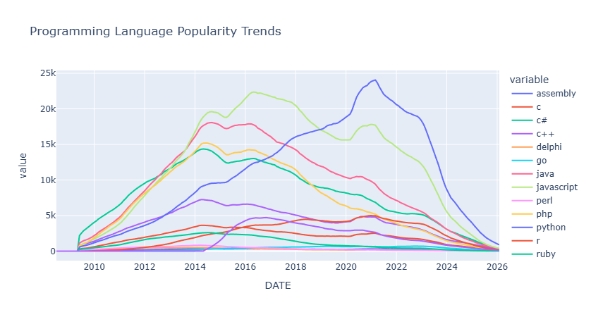
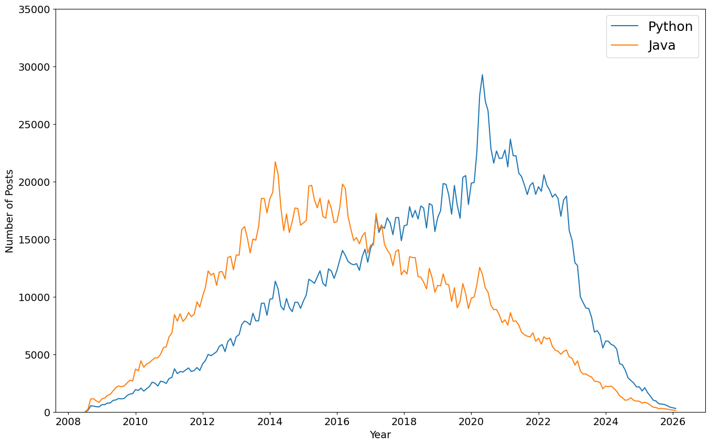

# Programming Language Trends Analysis



## Table of Contents
- [Project Overview](#project-overview)
- [Objectives](#objectives)
- [Dataset](#dataset)
- [Tools & Technologies](#tools--technologies)
- [Project Structure](#project-structure)
- [Key Analysis Steps](#key-analysis-steps)
- [Key Insights](#key-insights)
- [Example Visualization](#example-visualization)
- [How to Run This Project](#how-to-run-this-project)
- [Contributing](#-contributing)
- [License](#-license)
- [Author](#-author)

## Project Overview

This project analyzes trends in programming language popularity using Stack Overflow discussion data. The analysis explores how developer interest in various programming languages has evolved over time by examining the number of posts associated with each language.

The goal of the project is to identify patterns in language adoption, highlight technologies experiencing growth, and provide insights into long-term trends within the developer community.

## Objectives

The analysis aims to:

- Examine historical trends in programming language popularity
- Compare growth patterns across major programming languages
- Identify technologies gaining or losing developer interest
- Visualize changes in discussion activity over time

## Dataset

The dataset contains the number of Stack Overflow posts for various programming language tags over time.

**Key attributes include:**

- **Date** – Time period of the posts
- **Programming Language Tag** – Language associated with the posts
- **Number of Posts** – Total posts for that language within the period

The dataset was reshaped to allow easier comparison between programming languages.

## Tools & Technologies

The project was completed using:

- **Python** – Primary programming language
- **Pandas** – Data manipulation and analysis
- **Matplotlib** – Static visualizations
- **Plotly** – Interactive visualizations
- **Jupyter Notebook** – Development environment

These tools were used for data cleaning, transformation, analysis, and visualization.

## Project Structure
``` bash
programming-language-trends-analysis
│
├── data
│   ├── reshaped_df.csv
│   └── rolling_df.csv
│
├── notebook
│   └── programming_language_trends_analysis.ipynb
│
├── visual
│   ├── language_trends_plot.png
│   └── python_java_trend.png
│
├── requirements.txt
└── README.md

```


### Folder Details:

- **`data/`** – Contains datasets used for analysis
- **`notebook/`** – Jupyter notebook with the full analysis workflow
- **`visual/`** – Visualization outputs used in documentation
- **`requirements.txt`** – Python dependencies required to run the project
- **`README.md`** – Project documentation

## Key Analysis Steps

The project workflow includes:

1. **Data loading and inspection** – Initial exploration of the dataset
2. **Data cleaning and preparation** – Handling missing values and formatting
3. **Data reshaping** – Pivoting data for easier comparison across languages
4. **Time-series trend analysis** – Examining patterns over time
5. **Visualization** – Creating plots to illustrate language popularity trends
6. **Trend smoothing** – Applying rolling averages to identify patterns
7. **Insight generation** – Drawing conclusions from observed patterns

## Key Insights

Some key observations from the analysis include:

- **Python** shows strong and consistent growth in developer discussions over time
- **Java** remains one of the most stable languages, maintaining consistent engagement across years
- Certain programming languages experience periods of rapid popularity growth followed by stabilization
- The data highlights how developer interest shifts as new technologies emerge

These insights help illustrate how programming language ecosystems evolve within the software development community.

## Example Visualization



*Figure 1: Trends in programming language(python, Java) popularity over time based on Stack Overflow post counts*

## How to Run This Project

### 1. Clone the Repository

```bash
git clone https://github.com/YOUR_USERNAME/programming-language-trends-analysis.git
cd programming-language-trends-analysis
```

### 2. Set Up the Environment
Create a virtual environment (optional but recommended):

```bash
python -m venv venv
source venv/bin/activate  # On Windows: venv\Scripts\activate
```

### 3. Install Dependencies
Install the required packages using pip:

```bash
pip install -r requirements.txt
```


**requirements.txt:**
```
pandas
matplotlib
plotly
jupyter
ipykernel
numpy
```
### 4. Run the Jupyter Notebook
Start Jupyter Notebook:

```bash
jupyter notebook
```

Then navigate to and open:

```bash
notebook/programming_language_trends_analysis.ipynb
```


Run the cells sequentially to reproduce the analysis and visualizations.


## 🤝 Contributing
Contributions, issues, and feature requests are welcome! Feel free to check the issues page.

## 📝 License
This project is licensed under the MIT License – see the LICENSE file for details.

## 👤 Author
Edric Oghenejobor
Junior Data Analyst

GitHub: @jobor_marho

LinkedIn: [My Linkedin](https://www.linkedin.com/in/edric-oghenejobor-991536210/)


